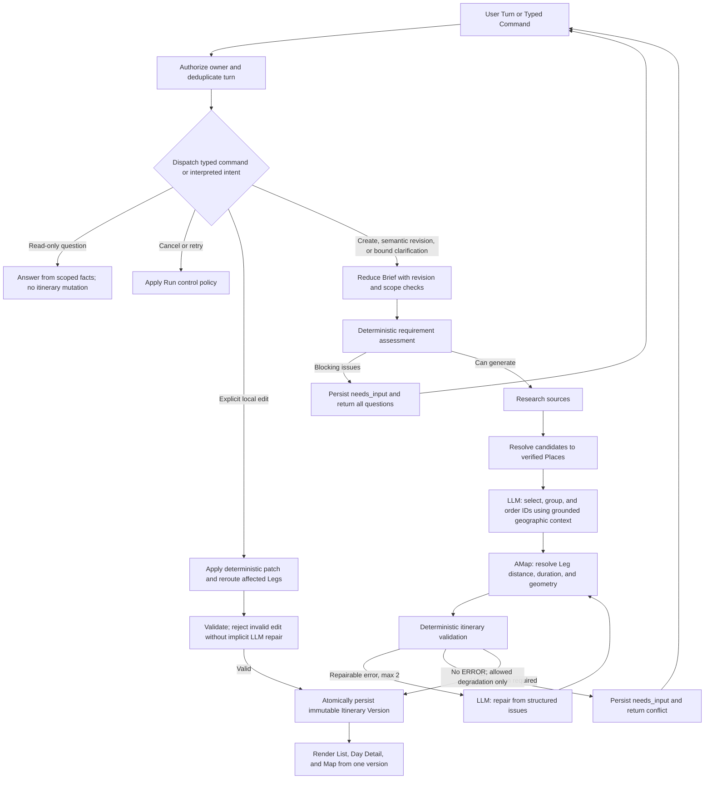

# Travel Agent MVP: Product And Workflow Design

Status: Implementation baseline. Phase 1 desktop fixture gate passed on 2026-09-08; see [execution evidence](../reviews/phase1-verification.md). Phases 2-6 remain unverified.

This document records the product and workflow decisions reviewed in the planning conversation. Changes that affect scope, domain language, workflow ownership, or validation policy must update this document before implementation continues.

## 1. Product Goal

Build a desktop Web application that turns a Chinese natural-language travel request into a source-aware, geographically grounded, editable daily itinerary.

The first useful result must let a traveler:

- request a trip such as "Beijing for three days, focused on cultural attractions";
- see a day-by-day Visit Order;
- inspect each day as a timeline and on a map;
- understand travel distance, duration, and transport mode between Visits;
- revise the itinerary through natural language or explicit controls;
- see assumptions, warnings, and sources rather than receiving invented certainty.

The List, Day Detail, and Map views are projections of the same Itinerary Version. They must never maintain independent copies of itinerary state.

## 2. MVP Scope

### Included

- Chinese-language interaction.
- One destination city per Trip.
- One to seven travel days.
- Attraction-oriented itinerary planning.
- Web research with source URL and retrieval time.
- AMap place grounding and Web map rendering.
- Day-by-day itinerary, Visit details, and travel Legs.
- Natural-language revisions.
- Explicit remove, move, lock, replace, duration, and regenerate-day commands.
- Anonymous Owner isolation, conversation history, and immutable itinerary versions.
- Recoverable Generation Runs and phase-based SSE progress.

### Excluded From MVP

- Flight, train, and hotel search, live prices, inventory, and booking. User-supplied arrival/departure windows and hotel addresses remain valid planning inputs.
- Multi-city optimization.
- Live turn-by-turn navigation or location tracking.
- Collaborative editing, public sharing, community, and messaging.
- Long-term preference memory.
- Runtime specialist agents for meals, lodging, or transport.
- Mobile layouts, mobile interaction patterns, and PWA installation/offline support.

## 3. Confirmed Decisions

1. The first client is a desktop Web application with a split workspace. Support desktop windows from 1024px wide; mobile and PWA are outside the requested scope.
2. The runtime is a modular monolith with an explicit business workflow.
3. LangGraph is not an MVP dependency. Business persistence supplies resumability and Human-in-the-loop behavior.
4. The model interface remains provider-neutral. The first live adapter is the user-selected DeepSeek configuration in Section 21, implemented in Phase 5.
5. Runtime subagents are not used for intent, search, place lookup, routing, or validation.
6. AMap Web Key is used only by the browser-facing JavaScript API.
7. Server-side AMap place and routing calls require a separate Web Service Key later.
8. SSE exposes phase progress and concise rationale, never raw model chain-of-thought.
9. All currently identifiable blocking Requirement Issues are returned together.
10. The current project development roles (`orchestrator`, `coder`, and `tester`) are separate from the product's runtime architecture.

## 4. Domain Model

Canonical terms are defined in [`CONTEXT.md`](../../CONTEXT.md).

```text
Owner
  `- Conversation
       `- active Trip
            |- Trip Brief
            |- current Itinerary Version
            |    `- Day Plan[]
            |         |- Visit[] -> Place
            |         `- Leg[] -> Leg Geometry
            |- Evidence[]
            `- Generation Run[]
```

An Itinerary Version is immutable. An accepted generation, natural-language revision, or Typed Command that changes the itinerary produces a new version. Previous versions remain available for audit and recovery.

## 5. Requirement Gate

Planning starts only when `blockingIssues.length === 0`.

### Always Blocking

- The destination city is missing or ambiguous.
- Neither day count nor a date range can establish trip duration.
- The request is outside the supported one-city, one-to-seven-day scope.
- Two Hard Constraints cannot both be satisfied without an Owner decision.

### Conditionally Blocking

- A must-visit Place is ambiguous.
- Exact date-dependent opening-time verification is required but dates are absent.
- A daily start Place is required but has not been identified.
- The requested density and pace are irreconcilable.

### Non-Blocking Defaults

- Dates, when the user does not require date-specific verification.
- Budget.
- Daily start time.
- Transport preference.
- Pace, companion type, meals, and lodging.

Absent non-blocking fields receive visible, editable Assumptions. Initial defaults are balanced pace, walking plus public transport, and a 09:00-18:00 planning window.

City support is an explicit adapter capability allowlist, not a promise of worldwide coverage. The first fixture city is Beijing; live cities enter the allowlist only after provider contract checks. Bind each destination to a canonical city identifier and allowed administrative areas. A remote attraction inside those areas is not rejected merely for distance; an attraction outside them requires an explicit scope decision. Unsupported cities or transport capabilities are returned at this gate with other known issues.

Dates absent means an undated proposal, not verified availability on a particular day. User-provided first/last-day time windows override defaults. Optional grounded start/end Places, including a supplied hotel address, add boundary transfers to the schedule. With no such input, explicitly state that the schedule starts at the first attraction and ends at the last; do not imply airport/hotel transfers are included.

Requirement evaluation returns all currently visible issues in one response:

```ts
type RequirementAssessment = {
  blockingIssues: RequirementIssue[];
  assumptions: Assumption[];
  warnings: Warning[];
};
```

The UI renders blocking issues as one compact form. After the Owner responds, the entire Trip Brief is assessed again because new answers may expose new ambiguity or conflicts.

## 6. End-To-End Workflow



### Generation Run States

```text
accepted
  -> checking_requirements
  -> needs_input | ready
  -> researching
  -> resolving_places
  -> drafting
  -> routing
  -> validating
  -> repairing -> routing -> validating
  -> completed | degraded
```

Every active state may also transition to `failed`, `cancelled`, or `superseded`.

The repair loop is bounded to two persisted attempts per Run. A remaining Hard Constraint conflict becomes `needs_input`; other exhausted failures become `failed`. Missing external facts may produce `degraded` only under Section 12. Control and read-only branches do not traverse generation phases.

### Intent And Mutation Contract

The interpreted intent is one of `create_trip`, `update_requirements`, `answer_clarification`, `ask_question`, `revise_local`, `revise_global`, or `unsupported`. Code validates the target, allowed actions, and scope before applying a patch. Ambiguous mutation intent returns all identifiable questions without speculative itinerary changes. Mixed read/write intent must expose its proposed mutation scope; uncertain scope requires clarification.

- Read-only questions may use grounded research and a model response, but never create a version or supersede an active planning Run.
- Creating another trip creates a new Trip and Conversation; it never replaces the existing Trip's history.
- A clarification answer names its waiting Run and issue revision. Stale answers are rejected; unrelated new requests cannot accidentally resume that Run.
- Local revisions name affected Day Plans/Visits. Everything outside that scope remains unchanged. Cross-day moves include both days and their affected Legs. Expanding scope requires an Owner decision.
- Explicit local edits bypass search and the model unless selected alternatives need grounding. Regeneration and semantic alternative selection may use the model.
- No-op edits do not create a version. Failed edits retain the current version and return structured issues.

## 7. Human-In-The-Loop Without LangGraph

Human-in-the-loop is a persisted business workflow, not a long-lived in-memory model call.

When input or a decision is required:

1. Persist the Generation Run phase, Trip Brief revision, unresolved issue revision, base itinerary version, and resume checkpoint.
2. Emit `run.needs_input` through SSE.
3. End the active HTTP response.
4. Render all questions or conflicts as structured controls.
5. Accept the Owner's next Turn through a new POST request.
6. Reload the Generation Run and resume from the appropriate phase.

SSE is an observation channel, not the durability mechanism. The database remains the source of truth after disconnects, page reloads, or process restarts.

A database-backed executor in the persistent Node service claims accepted or recoverable Runs at startup and periodically. Each claim has an expiring lease and fencing token; checkpoints and commits reject a stale token. Persist phase inputs, accepted outputs, adapter operation identifiers, attempt counts, and next retry time. Checkpoint before advancing phases and reuse saved outputs on recovery. An external read interrupted before checkpointing may repeat; exactly-once provider billing is not promised.

Execution does not depend on the SSE connection. Expired leases allow recovery; a live lease prevents duplicate execution. Cancellation and supersession persist before any later commit can succeed. A clarification Turn resumes only its bound waiting Run, preserves consumed budgets, and records the resolving Turn. Explicit retry of a failed Run creates a linked new Run after current version checks, with a new recorded budget; reconnecting is not retrying.

Version insertion, current-version pointer update, Run terminal state, and durable completion event are one transaction. A crash after commit but before SSE delivery returns the already committed result, never another version. Terminal results and events can be re-read without rerunning providers.

LangGraph should be reconsidered only if the product develops long-running cross-process graphs, multiple approval checkpoints, complex time travel, or independent specialist-agent failure domains.

## 8. Deep Modules And Interfaces

The outer application interface is intentionally small:

```ts
type TurnInput = {
  conversationId: ConversationId;
  turnId: TurnId;
  targetTripId: TripId | null;
  baseVersionId: ItineraryVersionId | null;
  baseBriefRevision: number;
  resume?: { runId: RunId; issueRevision: number };
  input: UserMessage | TypedCommand;
};

interface ConversationEngine {
  handleTurn(owner: VerifiedOwnerContext, input: TurnInput): AsyncIterable<TurnEvent>;
}
```

`ConversationEngine` hides authorization, message persistence, requirement collection, workflow dispatch, version checks, and progress streaming.

`VerifiedOwnerContext` comes only from server-verified credentials, never request JSON. For initial creation, target/version are null and Brief revision is zero; creation allocates the Trip atomically. For an existing Trip without an itinerary, only the version is null. All planning inputs and mutations carry the client-observed version and Brief revision; the server must not silently substitute current values. Read-only questions may reference an owned historical version without requiring it to be current.

Internal modules:

- **Itinerary Workflow**: creates or revises one itinerary and hides research, place resolution, drafting, routing, validation, repair, and commit ordering.
- **Itinerary Validator**: pure deterministic validation that returns structured issues without mutating the itinerary.
- **Trip Repository**: atomically loads and commits Trip state with ownership and base-version checks.
- **Travel Research**: external seam for source discovery and Evidence normalization.
- **Place Directory**: external seam for Place search, disambiguation, and coordinate grounding.
- **Route Provider**: external seam for Leg distance, duration, and geometry.
- **Structured Model**: external seam for schema-constrained model tasks.

Production adapters and deterministic fakes satisfy the external seams. Do not create shallow `IntentAgent`, `PlaceAgent`, `MapAgent`, or `ValidationAgent` wrappers.

The initial HTTP surface can remain small:

```text
POST /conversations
POST /conversations/:conversationId/turns
GET  /trips
GET  /trips/:tripId
GET  /runs/:runId
GET  /runs/:runId/events
```

The Turn endpoint durably accepts work before streaming progress. The events endpoint attaches to existing execution with a last-seen event ID; GET Run returns its authoritative snapshot if replay is unavailable. Trip reads accept an owned version identifier for history. Explicit domain changes are Typed Commands sent through the same Turn interface.

## 9. Zod And Domain Rules

Zod is the TypeScript runtime contract library; it is not the domain model.

Use Zod at system seams:

- HTTP input and output;
- LLM structured output;
- SSE events;
- normalized search and map-provider responses;
- persisted JSON snapshots;
- shared frontend read models.

Keep cross-record and provider-dependent rules in the Itinerary Validator. Zod may verify that a duration is a positive integer; the validator determines whether all Visit and Leg durations fit the Day Plan.

## 10. Model Responsibilities

### Use The LLM For

- Interpreting natural language into an intent and Trip Brief patch.
- Understanding soft preferences such as cultural focus and relaxed pace, while preserving explicit requirements such as "no stairs" as Hard Constraints.
- Ranking verified candidate Places for semantic fit and diversity.
- Selecting candidate IDs, grouping them by day, and proposing Visit Order.
- Mapping natural-language revisions onto stable Visit IDs.
- Performing a bounded repair from structured Validation Issues.
- Writing concise explanations from verified facts and Evidence IDs.

### Do Not Use The LLM For

- Authorization, isolation, idempotency, state transitions, or version commits.
- Inventing Place IDs, coordinates, URLs, opening hours, distance, duration, or Leg Geometry.
- Date arithmetic, overlap checks, route continuity, caches, retries, or shortest-path calculation.
- Navigation-only UI actions, intent interpretation for Typed Commands, or execution of deterministic Typed Commands. Explicit regeneration and requested semantic alternative selection may invoke their bounded model tasks.
- Deciding whether stale work may overwrite the current Itinerary Version.

The model may only reference IDs supplied in its task input. Code joins those IDs back to canonical Place and Evidence data.

## 11. Prompt Design

Do not build one universal travel-agent prompt. Version these task prompts independently:

- `extract_trip_brief`
- `extract_evidence_facts`
- `compose_itinerary`
- `revise_itinerary`
- `repair_itinerary`
- `write_summary`

Each prompt contract specifies permitted fields/IDs, positive and negative examples, empty/refusal/incomplete-output handling, and an explicit token/retry budget. Schema failures do not authorize inventing a fallback object. Task prompts are runtime artifacts; project `AGENTS.md` governs development and is not the travel model's system prompt.

Each task receives:

1. stable system invariants;
2. task-specific rules;
3. structured Trip Brief, current version, candidate, Evidence, or Validation Issue data;
4. the relevant user text;
5. a strict JSON Schema with additional properties disabled.

Web content is untrusted Evidence. Instructions found in pages are data and must never grant tool access or override system rules. Do not use self-reported model confidence as a requirement gate; return explicit missing fields and ambiguity types instead.

Record `promptVersion`, model ID, referenced Evidence IDs, validation results, latency, and token usage for evaluation and replay. Logs must redact credentials, precise location when unnecessary, and sensitive user text.

## 12. Validation Policy

Validation results use three severities:

- `ERROR`: prohibits any new Itinerary Version, including degraded versions; repair, failure, or Owner input is required.
- `WARNING`: may commit as degraded but must be visible in the UI.
- `ASSUMPTION`: a visible default that the Owner can edit.

### Requirement Validation

- Required destination and duration are present.
- Destination and must-visit references are unambiguous.
- The Trip is within MVP scope.
- Hard Constraints do not conflict.

### Schema Validation

- No unknown fields are present.
- IDs, enums, day indices, time values, and durations match their schemas.
- Every model-emitted reference points to a supplied candidate, Visit, or Evidence ID.

### Place Grounding

- Each Visit references one confirmed Place.
- The Place belongs to the intended destination area.
- Coordinates and coordinate system are present and valid.
- Duplicate Places are rejected unless explicitly requested.

### Itinerary Structure

- Day count and contiguous day indices match the Trip Brief.
- Visit IDs are stable and unique.
- Must-visit Places are included and excluded Places are absent.
- Daily Visit count and intended pace remain reasonable.

### Time Feasibility

- Visit durations are positive and within configured bounds.
- Visit plus Leg time fits the daily planning window.
- Visits do not overlap.
- Known opening windows and fixed-time constraints are respected.
- Unknown or date-sensitive opening times create visible Warnings.

### Route Validation

- Every adjacent pair of Visits has exactly one corresponding Leg.
- Leg origin and destination match the adjacent Visits.
- Transport mode is supported.
- Provider distance and duration are used instead of model estimates.
- Unreachable or unavailable Legs are never drawn as road routes using straight lines.

### Evidence Validation

- Factual claims reference existing Evidence IDs.
- Evidence records source URL and retrieval time.
- Unsupported claims and fabricated citations are removed.
- Stale or uncertain facts are labeled.

### Ownership And Concurrency

- Owner and Conversation ownership match.
- Turn ID is idempotent.
- The submitted base version is still current.
- A cancelled or superseded Generation Run cannot commit.

### Scheduling And Fact Ownership

Code computes arrival/departure times from Visit Order, supplied constraints, route facts, and a versioned scheduling policy. Planned Visit duration uses, in order: explicit Owner duration, applicable sourced recommendation, or a visible editable policy Assumption. These are planned stays, not provider-confirmed transport facts. Models may select supplied duration-option IDs but may not produce numeric durations.

Before Phase 3 schedule implementation, the policy fixture must contain concrete stay-duration bounds/defaults, meal/rest blocks, entry/transfer buffers, and pace/walking limits with units and provenance. User overrides take priority unless they violate a Hard Constraint. Do not double-count buffers already included in provider durations. Breaks and boundary transfers are schedule blocks, not fabricated attraction Visits. A policy default is not a sourced fact.

Research records include Place binding, fact field/value, supporting excerpt, source URL, retrieved time, applicable dates, and known/unknown/conflicting status. Minimum admission fields are opening windows, closure dates, latest entry, reservation requirements, and entry conditions. Known unsatisfied conditions block; unknown conditions show warnings unless verified access was explicitly required, in which case they block. Reservation advice never guarantees availability or performs booking.

### Route Degradation Matrix

| Available result | Validation and presentation |
| --- | --- |
| Confirmed duration and geometry | Validate the schedule and render provider geometry. |
| Confirmed duration, no geometry or distance | May commit degraded if otherwise valid; show missing fields and omit the unavailable route line/distance. |
| Missing duration, not known unreachable | Keep a non-committed draft, mark time feasibility unverified, and offer retry or a different mode/Place; no invented numeric schedule or completed version. |
| Known unreachable, known admission conflict, or violated Hard Constraint | ERROR; repair within scope or request an Owner decision. Never bypass through degraded. |
| Required accessibility facts unknown | Block when explicit accessibility requirements cannot be verified; never assert compliance from ordinary routing alone. |

The same rules apply to boundary transfers. Map loading failure is a presentation failure, not permission to mutate a valid itinerary.

### Research And Planning Budgets

Travel Research owns query construction, bounded search/fetch, deduplication, fact extraction, and normalized Evidence. Constrained model extraction is allowed; code checks supplied source IDs, Place/field binding, dates, and provenance. ID existence alone cannot prove textual entailment; unsupported prose is removed and semantic source support is evaluated separately.

Use applicable official venue notices before other sources; conflicts that cannot be resolved by authority and applicability remain explicit. Do not merge incompatible hours into a convenient window. The Phase 5 adapter policy must pin freshness periods by fact type, candidate/search/fetch/route limits, timeout/retry/token limits, and at most one supplementary search round for missing coverage. Budget exhaustion returns a typed failure or unresolved issue, not an unbounded loop.

Give drafting grounded city/area relationships and bounded route comparisons before final ordering. Request detailed routes for the selected adjacency pairs; reuse valid results during local edits. Geography may guide candidate filtering, but straight-line proximity is never rendered or reported as a provider route. Global route optimality is not an MVP promise.

## 13. SSE Progress Contract

Show phase progress, not raw chain-of-thought and not invented percentages.

Initial event vocabulary:

```text
run.started
requirements.checked
run.needs_input
research.started
research.sources_found
places.resolved
itinerary.drafted
routing.started
validation.started
itinerary.repairing
itinerary.completed
run.no_change
run.degraded
run.failed
run.cancelled
run.superseded
```

Useful UI text includes "Searching for Beijing cultural attractions", "14 Places confirmed", and "Day 2 is too dense; adjusting the route". It must not expose hidden prompts, raw model reasoning, credentials, or untrusted page content.

SSE is sufficient for server-to-client updates. User Turns and commands use POST. After reconnect, the client loads current state by `runId`; WebSocket is not required for MVP.

Persist monotonic per-Run event IDs with Run/Turn/version references. Duplicate replay is harmless; clients ignore older events and never let stale Run completion replace their current version. Reconnection observes ongoing work and must not submit a new generation.

`run.no_change` is a terminal successful result for an already-satisfied Typed
Command. It references the existing non-null version, does not announce a new
version, and closes progress observation. Its Run state is `completed`. Exact
transaction and replay rules are in design 0005.

## 14. UI Operations

### Presentation-Only Operations

These do not invoke the model:

- switch between overview, day detail, and map;
- select a day;
- select a map marker;
- pan, zoom, locate, or change the visible map layer;
- open Evidence, Warning, or Place details.

### Typed Commands

These bypass natural-language intent interpretation:

- remove a Visit;
- move or reorder a Visit;
- move a Visit to another Day Plan;
- lock or unlock a Visit;
- update Visit duration;
- update day start time or transport mode;
- replace a Visit with a selected alternative;
- regenerate one day;
- cancel or retry a Generation Run.

A command may still trigger deterministic rerouting and validation. It invokes the model only when semantic selection or regeneration is actually necessary.

MVP `lock` freezes the Visit's Place, day, planned duration, and relative order among other locked Visits. It does not freeze clock time; fixed arrival time is a separate Hard Constraint. UI copy must reflect this contract. Changing/removing/replacing/moving a locked Visit requires explicit unlock; neither regeneration nor repair can silently unlock it.

Surviving Visits retain IDs across versions; replacement creates a new Visit ID. Removal also records a Trip-level excluded Place until the Owner explicitly re-adds it; removal of a must-visit requires resolving that conflict first. An explicitly emptied day is allowed and shown as free time, but generation cannot silently drop must-visits. Shrinking trip duration across a locked day requires a decision, not automatic relocation.

## 15. Frontend Information Architecture

The reference screenshots under `ref/` provide four useful projections:

1. **Trip Library**: existing Trips and a primary create action.
2. **Itinerary Overview**: compact Day Plan summaries and Visit Order.
3. **Day Detail**: Visit timeline, durations, descriptions, and Legs.
4. **Map**: full map, day selection, markers, route geometry, and a bottom route summary.

The MVP also requires a fifth surface absent from the references:

5. **Planning Conversation**: requirement form/chat, Generation Run phases, questions, assumptions, and natural-language revision.

Desktop uses a conversation column beside the itinerary or map. At narrower desktop widths, the conversation may use a toggled side panel, preserving selection and focus. Do not expose placeholder Community, Messages, or Social navigation before those products exist.

Required states include empty, collecting requirements, researching, resolving places, drafting, routing, repairing, completed, degraded, failed, cancelled, offline/reconnecting, and stale-version conflict.

Overview and day timelines share one continuous list surface with day anchors; these projections do not require separate routes. Library cards show destination, day count, optional dates/origin, and a map entry; absent dates have an edit action. Images need recorded usable sources, meaningful alt text, and failure placeholders, not invented photos.

List/map switching preserves `tripId`, `versionId`, `dayIndex`, and `selectedVisitId`; Leg selection adds `selectedLegId`. Markers, timeline items, and the map bottom panel refer to the same IDs. Selecting a marker or list item updates selection and the corresponding detail; selecting a Leg shows only that Leg's recorded transport facts.

The desktop conversation and map detail panels occupy separate layout regions; toggling conversation restores map selection. An explicit route-edit mode shows pending changes and confirmation/errors. Failed or cancelled revision keeps the old version visible with a modification-specific error. A selected Visit removed by a successful revision clears selection within the affected day. Verify keyboard focus, screen-reader labels, and no overlap at 1024px, 1280px, and 1440px desktop widths.

## 16. Map Integration

The supplied credential's platform type is unverified. Confirm its capability in the provider console before use; a key string alone does not establish that it is a Web Key.

Use the browser JavaScript API for:

- map rendering;
- markers and information windows;
- user-initiated geolocation;
- interactive route presentation;
- optional client-side place autocomplete.

The Web Key must be domain-restricted and configured using AMap's current JavaScript security mechanism. It must not be treated as a server credential.

Before production planning can ground Places and validate Legs on the server, obtain an AMap Web Service Key. Keep Web and Web Service credentials separate. Persist coordinate-system provenance; AMap data uses GCJ-02.

Geolocation is optional, permission-gated, and non-blocking. A traveler can always choose a city or start Place manually.

## 17. Persistence And Isolation

Initial persisted records:

- Owner;
- Conversation;
- Message;
- Trip with current version reference;
- Trip Brief snapshot;
- Itinerary Version JSON snapshot;
- Generation Run;
- normalized Place cache;
- Evidence.

Every query is scoped by Owner and resource ID. Never authorize access using a guessable Conversation or Trip ID alone.

Each mutation carries a Turn ID and base itinerary version. Commit uses optimistic concurrency. The MVP uses latest-wins for generation: newer work cancels or supersedes older work, and a stale Generation Run cannot overwrite the current version.

The HTTP boundary issues an opaque anonymous credential in a Secure, HttpOnly, SameSite cookie and derives Owner from its server-side validation. Mutation requests require same-origin/CSRF protection. Client-submitted Owner fields are rejected. Expired or cleared credentials cannot recover anonymous history automatically; no cross-device recovery is promised. Missing/foreign resources return non-disclosing errors through the same authorization path, including SSE, Evidence, history, and Run control.

Idempotency is scoped to Owner, Conversation, and Turn ID. The same ID with the same canonical request returns its saved result; changed payload with that ID is a conflict. Persist acceptance and allocate a per-Trip mutation sequence atomically after ownership/base checks. Only a newer accepted mutating Turn for that Trip supersedes old work; failed precondition checks, Q&A, and other Conversations do not. A bound clarification is the explicit resume exception in Section 7.

Run commit atomically checks current version, Brief revision, mutation sequence, terminal/cancellation state, and executor fencing token. Brief edits increment its revision even before the first version exists. The displayed version retains its own Brief snapshot; uncommitted Brief changes are pending and cannot rewrite historical projections.

Version snapshots freeze used Place facts, schedule policy version, Legs, geometry, assumptions/warnings, and field-level Evidence or immutable Evidence revisions. Updating provider caches must not change any historical projection. Late route completion is a new explicitly requested versioned mutation with normal base checks, never an in-place map patch.

Model conversation state is not the business database. Model context is rebuilt from the Trip Brief, current Itinerary Version, a short conversation summary, and only the recent Turns needed for the active task.

## 18. Technical Baseline

Recommended initial stack:

- Next.js, React, and TypeScript;
- SQLite on local disk for the single-host deployment (user-confirmed);
- Zod for runtime contracts;
- SSE for progress;
- AMap JavaScript API for browser map rendering;
- provider-neutral `StructuredModel`, `TravelResearch`, `PlaceDirectory`, and `RouteProvider` interfaces.

The model API has been supplied; its live adapter is scheduled for Phase 5.
Phase 1 uses presentation fixtures, and Phase 4 verifies the workflow with
deterministic fake adapters before live integration.

Use a persistent Node runtime for long SSE requests during MVP deployment. If platform request limits later require a separate worker process, keep the same module interfaces and persistence model.

SQLite replaces the initial PostgreSQL recommendation by user decision.
Initialize schema migrations at startup; keep the database, WAL and shared-memory
files outside Git. Enable foreign keys, WAL and a bounded busy timeout on each
connection. Use short write transactions for acceptance, optimistic checks,
leases and version/event commits; never hold a transaction across provider calls.
Owner-scoped reads, idempotency, fencing and durable recovery remain mandatory.
The supported deployment is one host with a local persistent disk, not a shared
network filesystem or horizontally scaled application. Backups must use a
consistent SQLite snapshot rather than copying an active database file alone.
Docker and a separately installed database service are not prerequisites.

## 19. Implementation Plan

### Phase 0: Design Baseline

- Save this design and domain glossary.
- Add project invariants to `AGENTS.md`.
- Close the design review and hand off bounded Phase 1 tasks using Section 20 acceptance IDs.

Review gate: scope, language, workflow, validation policy, and frontend information architecture are accepted. This revision records that design acceptance, not a passed implementation test.

### Phase 1: Contract-First Web Skeleton

- Scaffold the desktop Web application and application shell.
- Define Zod domain, command, read-model, and SSE schemas.
- Build fixture-backed Trip Library, Overview, Day Detail, Map shell, and Planning Conversation.
- Implement desktop navigation and adaptive desktop split views; no mobile or PWA deliverables.
- Add a fixture-only interaction harness for pending edits, rejected edits, cancelled revisions, missing images, and overlay/focus states. This verifies presentation without claiming real persistence or mutation execution.

Review gate: all core screens work from one fixture Itinerary Version without any LLM or external API.

Gate result: passed for Phase 1 AC-12 and shared schemas. The verification report
records 30 passing unit tests, 27 passing desktop browser tests, typecheck/lint,
production build, and 12 inspected production screenshots. This does not pass
any live-provider, persistence, isolation, or production-mutation gate.

### Phase 2: AMap Browser Vertical Slice

- Inject the Web Key through environment configuration.
- Load AMap securely.
- Render verified fixture Places, markers, day selection, and route geometry.
- Add optional geolocation and manual fallback.

Review gate: maps render reliably at supported desktop widths; map failure does not break list/detail views.

### Phase 3: Domain And Persistence

- Implement Trip Brief reduction and Requirement Assessment.
- Implement immutable Itinerary Versions, Typed Commands, and optimistic concurrency.
- Implement Generation Run state transitions and anonymous Owner isolation.
- Add deterministic Itinerary Validator.
- Implement the deterministic scheduler with reviewed, versioned stay-duration, break, buffer, and pace policy fixtures, including optional boundary transfers and shortened daily windows.

Review gate: two Owners and two Conversations remain isolated; stale versions cannot commit.

### Phase 4: Workflow With Fakes

- Implement Conversation Engine and Itinerary Workflow through their public interfaces.
- Wire fake research, place, route, and model adapters.
- Implement needs-input, repair, degraded, cancellation, and superseded paths.
- Stream phase events through SSE and resume by run ID.

Review gate: the complete Beijing three-day scenario works deterministically without network dependencies.

### Phase 5: External Adapters

- Add the supplied LLM API adapter.
- Add the selected Web research provider and Evidence extraction.
- Add AMap Web Service place and route adapters after that Key is available.
- Add retries, timeouts, caches, quotas, and credential redaction.

Review gate: live generation grounds every Visit and route fact, records Evidence, and never invents provider data.

### Phase 6: Evaluation And Hardening

- Consolidate prompt versions and reproducible eval fixtures introduced during adapter integration.
- Extend workflow integration, provider contract, and end-to-end regression tests added in earlier phases.
- Add accessibility, responsive visual, reconnect, error, and performance checks.
- Add tracing and privacy-aware operational metrics.

Review gate: acceptance scenarios and failure paths pass without live-provider dependencies in normal CI.

## 20. Verification Strategy

These stable acceptance IDs are the shared contract for coder tasks and tester reports. A documented expectation is not a passing test. Each report records ID, implementation revision, fixture/policy/prompt versions, command or manual steps, observed evidence, and `pass`, `fail`, `blocked`, or `not_run`.

### Acceptance Matrix

| ID | Scenario and required outcome | Earliest gate / evidence |
| --- | --- | --- |
| AC-01 | Missing city/duration, ambiguous must-visit, and conflicting constraints return all currently identifiable blockers together. Include exact-date verification without dates, a required but missing daily start Place, and irreconcilable density/pace. Answers re-evaluate the complete Brief. Unsupported city/day count is rejected before paid planning calls. | Phase 3 domain tests; Phase 4 workflow |
| AC-02 | "Why this Place?" creates no itinerary version and does not supersede planning. Another destination request creates a separate Trip/Conversation. Bound clarification resumes only the matching issue revision. Ambiguous or unsupported intent cannot mutate speculatively. | Phase 4 workflow with model-call assertions |
| AC-03 | "Make day two more relaxed" changes only the allowed day and its Legs; days one/three and surviving Visit IDs remain unchanged. Locks and must-visits survive repair; deletion exclusions persist. Empty-day and shortened-trip conflicts follow Section 14. | Phase 3 command tests; Phase 4 semantic revision |
| AC-04 | Remove/move/duration/selected replacement use deterministic paths; no unintended model/research call. Explicit day regeneration and requested semantic alternative selection invoke only their bounded model tasks, without NLP intent interpretation for Typed Commands. Invalid edits do not commit or invoke semantic repair. Cancel does not start generation; retry uses a linked Run. | Phase 3 command tests; Phase 4 call tracing |
| AC-05 | Missing Visit duration uses visible versioned policy, not model numbers. Breaks/buffers and boundary transfers count once. Afternoon arrival shortens day one; known latest-entry/opening violations block. Unknown required access/accessibility blocks. | Phase 3 schedule fixtures/property tests |
| AC-06 | No overlap; contiguous days, unique IDs, must-visits/exclusions, correct adjacent Legs and supported modes. Exercise every Section 12 degradation row; ERROR never commits, including as degraded. Missing route duration never produces a verified timeline. | Phase 3 validator; Phase 4 provider fakes |
| AC-07 | Model-invented coordinates, durations, URLs, unknown IDs/fields, refusal, incomplete JSON and exhausted schema retries fail safely. Only supplied IDs reach canonical facts; repair stops at two persisted attempts. | Phase 4 structured-model contract/integration |
| AC-08 | Forged Owner and foreign Conversation/Trip/Run/version/Evidence IDs cannot read, mutate, subscribe, cancel, or retry. Two Conversations of one Owner cannot implicitly share context; two Owners cannot access each other's data. Expired credentials and cross-site mutation are rejected safely. | Phase 3 repository/HTTP; Phase 4 SSE tests |
| AC-09 | Same Turn and payload replays one outcome; same ID/different payload conflicts. Stale NLP and typed edits fail; first-generation Brief races are detected. Only the valid latest mutation may commit; Q&A never cancels it. | Phase 3 transactional concurrency; Phase 4 races |
| AC-10 | Crash before/after external calls and before/after commit recovers under lease/fencing checks, retaining retry counts. Expired executor cannot write; one version commits. Disconnect/reload observes the same Run; commit-before-SSE replays the saved terminal result. Stream payloads expose allowed phase fields and concise rationale, never raw reasoning, hidden prompts, credentials, or invented percentages. | Phase 4 fault-injected executor/stream and payload tests |
| AC-11 | Changing Place/Evidence caches cannot change historical List/Day/Map, sources, or schedule policy. Late routing cannot patch an existing version. Rejected/cancelled revisions preserve the old display. | Phase 3 snapshot tests; Phase 4 integration |
| AC-12 | Library, continuous overview/day list, map shell and conversation use one version. Day/Visit/Leg selection persists across switches. Desktop conversation/map detail panels do not overlap; edit failure and image fallback are usable. Keyboard focus and labels work. | Phase 1 browser tests plus screenshots at 1024px, 1280px, and 1440px desktop widths; Phase 6 repeat |
| AC-13 | Verified fixture coordinates/geometry render with correct provenance; selected markers and route panel agree. Denied location, unavailable SDK, and missing geometry do not break list/detail; no straight line is presented as a road route. | Phase 2 real-browser checks at supported desktop widths |
| AC-14 | Evidence links each critical fact to the correct Place/field, excerpt and applicability; unrelated citations do not pass. Conflicting/stale/missing admission facts remain visible or block as required. Malicious web instructions cannot change tool permissions or expose credentials. | Phase 4 malicious/conflict fixtures; Phase 5 adapter/source checks |
| AC-15 | Timeouts, rate limits, insufficient candidates, unavailable routes and search failures respect recorded budgets; supplementary search stops at its limit. Credential capability mismatch fails safely. Synthetic sentinel tests verify secrets cannot enter logs, prompts, SSE, persisted fixtures, or captured UI; scan repository/artifact outputs for accidental credentials before live integration and release. Never use a real credential as a test fixture. | Phase 4 failure/redaction fakes; Phase 5 live contract smoke and artifact scan |
| AC-16 | Prompt changes run fixed baseline and separate regression cases; report objective constraints/ID/source metrics and reviewed preference quality, with prompt/model/tool/policy versions. No prose golden snapshots or invented pass rates. | Phase 5 initial eval; Phase 6 regression gate |
| AC-17 | Complete the Beijing three-day cultural scenario, revise day two, compare all projections/history, reload during generation, and repeat isolation/failure cases. Live mode must actually use research/Place/route/model adapters, not silently fall back to fixtures. | Phase 4 deterministic E2E; Phase 5 live smoke; Phase 6 regression |

### Phase Exit Rules

- Phase 1: AC-12 fixture-backed surfaces and shared schemas pass; maps remain explicitly fixture/shell state.
- Phase 2: AC-13 passes with a capability-verified browser credential. Credential absence blocks this gate, not unrelated fixture/domain work.
- Phase 3: domain/repository/HTTP portions of AC-01, AC-03 through AC-06, AC-08, AC-09, and AC-11 pass. Concrete scheduling defaults must be reviewed in versioned fixtures before schedule coding.
- Phase 4: all fake-backed workflow portions of AC-01 through AC-11, AC-14, AC-15, and AC-17 pass, including crash/race tests. Frontend fake workflows must also satisfy AC-12 after integration.
- Phase 5: live parts of AC-13 through AC-17 pass with pinned adapter policies and evaluated prompt baseline. Missing credentials/providers are reported as blocked, never replaced with a fixture pass.
- Phase 6: all applicable automated regressions pass without live providers in normal CI; responsive/accessibility/manual evidence and a separate live smoke report accompany release readiness. No unresolved failing hard invariant is waived by a quality score.

Tests are added in the phase that introduces behavior, not postponed wholesale until Phase 6. Phase 6 consolidates regression coverage and hardening. Performance/cost budgets must be agreed against the selected model, provider limits, and deployment before the live gate; this document claims no measured latency or quality threshold.

### Prompt Evaluation Loop

Keep fixed inputs/tool outputs and separate tuning/regression sets. Cover read-only questions, correction, ambiguity, no dates, half-day arrival, local revisions, locks, insufficient search, provider failure, and injected web instructions. First classify failures as extraction/schema, fact grounding, hard-constraint, scope preservation, or semantic quality; then change the smallest responsible prompt/policy and compare against the recorded baseline.

Code scores schema, ID legality, hard constraints, scope and timing. Human review checks source entailment, cultural-preference fit, useful diversity, and explanation support using recorded examples: unsupported/contradictory, partially supported, or supported and relevant. Record per-case judgments and disagreements, not just an aggregate score. Hold model/tool fixtures constant for prompt comparisons; test model/provider changes separately. Never approve a hard-constraint regression because average prose quality improved.

### Review Traceability

Historical findings in [the design review](../reviews/0001-mvp-design-review.md) map to acceptance IDs:

| Findings | Acceptance IDs |
| --- | --- |
| S1, S2, S3, S4 | AC-09, AC-08, AC-10, AC-11 respectively |
| S5 and P3 | AC-05, AC-06 |
| P1, P2, P4, P5 | AC-02, AC-03, AC-14, AC-01 respectively |
| C1, C2, C3, C4, C5 | AC-04, AC-06, AC-14, AC-16, AC-13/AC-15 respectively |
| Accessibility cross-check | AC-05, AC-06 |
| Frontend reference review | AC-12, AC-13, AC-17 |

## 21. External Inputs Still Required

- User-selected LLM endpoint is `https://api.deepseek.com`, model `deepseek-v4-flash`. The credential was supplied privately and is not recorded here or used in Phase 1. Verify endpoint/model capabilities and authentication during Phase 5; no live connectivity is implied.
- Console-confirmed AMap credential platform type and JavaScript security configuration for browser use.
- AMap Web Service Key for server-side Place and route grounding.
- Web research provider or hosted search-tool decision.
- Deployment target and its request-duration/SSE constraints.

## 22. Research Basis

Primary-source research and applicability notes are recorded in [`docs/research/agent-architecture-sources.md`](../research/agent-architecture-sources.md). The implementation should recheck provider and SDK behavior against pinned dependency versions before integration.
